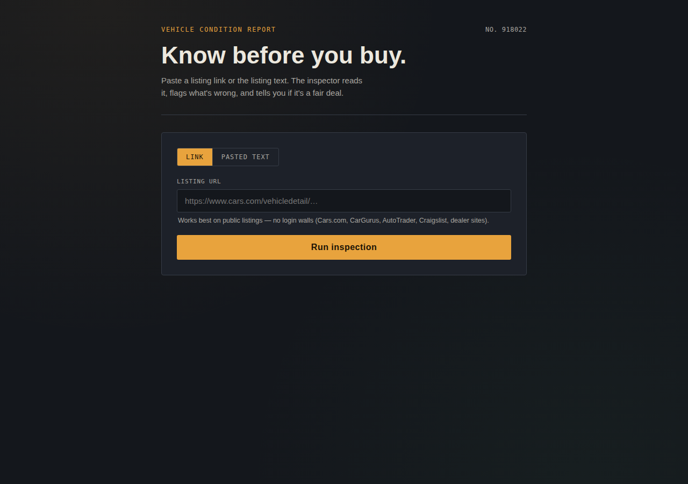
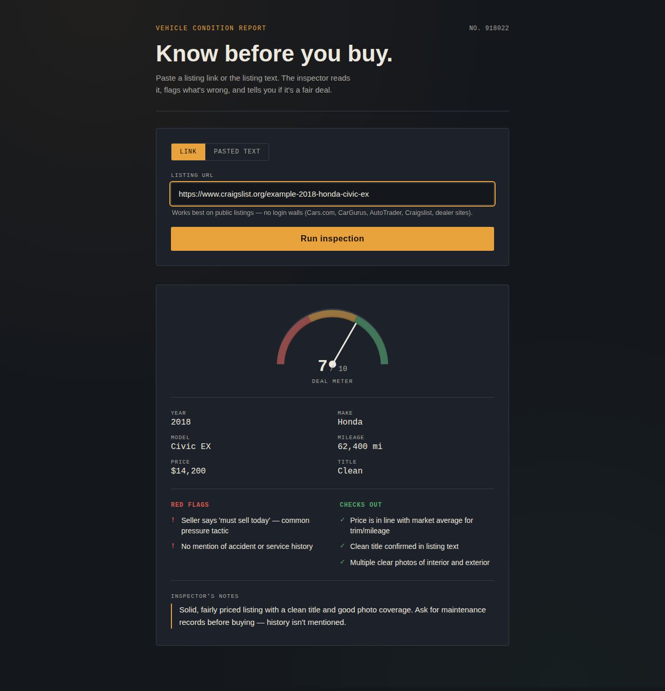
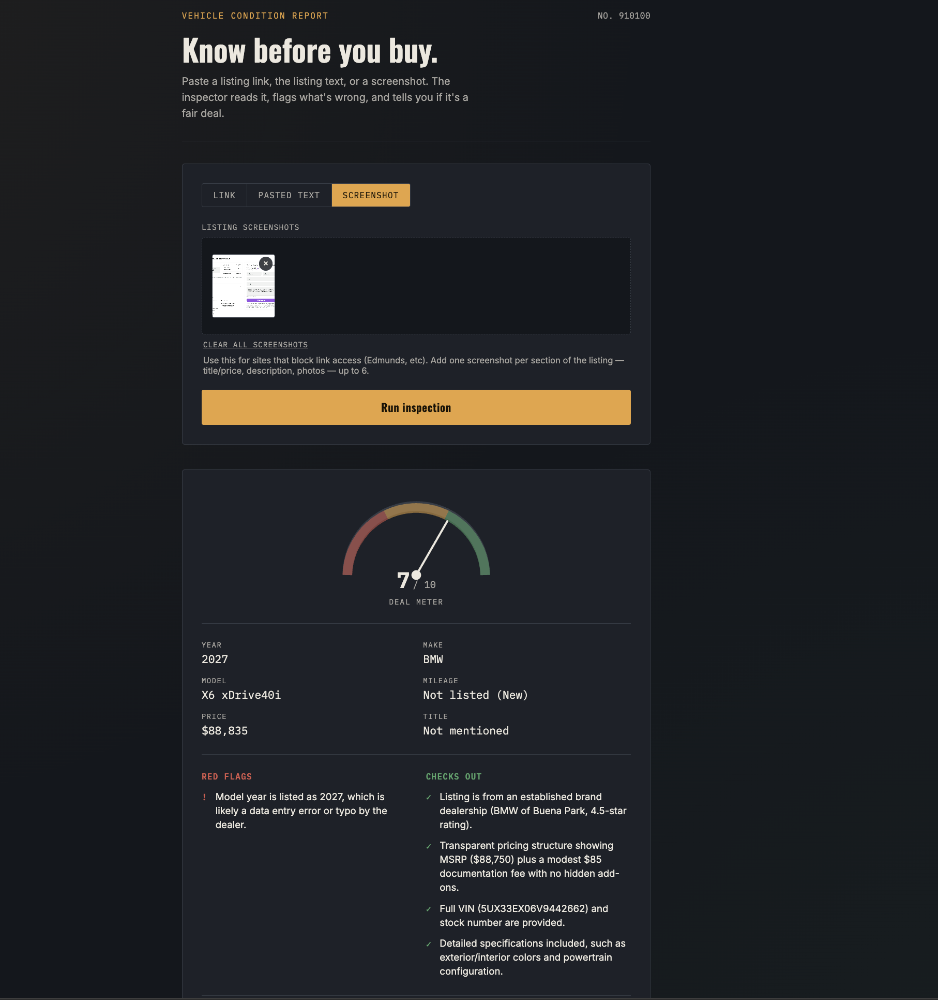

# Know Before You Buy — Car Listing Inspector

Paste a used car listing (link, text, or one or more screenshots) and get back a structured inspection report: extracted specs, red flags, positive signals, a 1–10 deal score, and a plain-language verdict — powered by the Gemini API.

Built at [Gemini Student Build — Portland](https://events.mlh.com/events/14512-gemini-student-build-portland), a hackathon hosted by Google and [MLH](https://mlh.io).



## Features

- **Three input modes** — paste a listing URL, paste the raw listing text, or drop in one or more screenshots.
- **Gemini `url_context` tool** — for URL mode, Gemini fetches the listing page itself server-side. No scraping code, no CORS issues.
- **Screenshot mode** — for listings behind a login wall or on sites that block `url_context` (Edmunds, etc.), click to browse, drag files in, or paste (Ctrl/Cmd+V) screenshots. Add up to 6 — e.g. one for the header/price, one for the description — and Gemini combines them into a single report.
- **Structured output** — a JSON schema forces a consistent response every time: specs, red flags, positive signals, score, summary, photo URLs.
- **Deal meter, spec grid, and flag lists** rendered as a printable-style "vehicle condition report."





## Tech stack

- **Backend:** Python, Flask, [`google-genai`](https://pypi.org/project/google-genai/) (Gemini API)
- **Frontend:** vanilla HTML/CSS/JS — no framework, no build step

## How it works

- The Flask backend (`app.py`) holds the Gemini API key and calls the Interactions API's `client.interactions.create()`.
- For URL input, Gemini's built-in `url_context` tool fetches the listing page server-side.
- For pasted text, the listing content goes straight into the prompt.
- For screenshots, the frontend reads each file as base64 and sends them as inline image content blocks — Gemini reads the listing details directly off the image(s), no OCR step of our own required.
- A JSON schema forces a consistent, structured response every time (score, specs, flags, summary, photo URLs).
- The frontend (`static/script.js`) only talks to our own `/api/analyze` route — it never sees the Gemini API key.

```
Browser (script.js)
     │
     │  POST /api/analyze  { mode, value }
     ▼
Flask (app.py)
     │
     │  client.interactions.create(model, input, tools, response_format)
     │  — GEMINI_API_KEY attached here, server-side only
     ▼
Gemini Interactions API
     │
     │  (url_context tool fetches the listing page, if mode = "url")
     ▼
Structured JSON response
     │
     ▼
Flask returns parsed JSON → Browser renders the report
```

## Getting started

1. Clone the repo and install dependencies:
   ```bash
   git clone https://github.com/xqetsia/car-listing-inspector.git
   cd car-listing-inspector
   pip install -r requirements.txt
   ```

2. Create a `.env` file in the project root with your [Gemini API key](https://aistudio.google.com/apikey):
   ```
   GEMINI_API_KEY=your-actual-key-here
   ```

3. Run the app:
   ```bash
   python3 app.py
   ```

4. Visit `http://localhost:5000`

## Project structure

```
car-listing-inspector/
├── app.py                  # Flask app: serves the page, calls Gemini via /api/analyze
├── requirements.txt         # Python dependencies
├── .env                     # Your GEMINI_API_KEY (gitignored, you create this)
├── templates/
│   └── index.html           # Page markup (Jinja template)
└── static/
    ├── style.css             # Styling
    └── script.js              # Frontend logic — calls /api/analyze, renders the report
```

## Known limitations

- Works best on public, login-free listings (Craigslist confirmed working; some sites like Cars.com block `url_context` outright — use "Pasted text" or "Screenshot" mode as a fallback).
- The photo carousel only populates when Gemini can extract usable image URLs from the page, which isn't guaranteed for every listing. Screenshot mode never populates it, since there's no page to pull photo URLs from.
- Screenshots are capped at 8 MB each, must be PNG, JPEG, or WEBP, and up to 6 per inspection.

## License

MIT — see [LICENSE](LICENSE).
